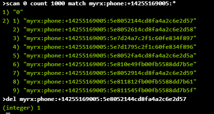

# Steps to do to clear the cache

## Login to Redis in Azure

1. Go to url https://portal.azure.com/ and login

2. Search for the resource redis-myrx-westus-test

3. Click on "Console" link

4. It should open a console.

## Various Redis Commands

Below are commands to get and remvoe values from redis

### Retrieving a key

_get keyname_

example: **get myrx:phone:+14255169005:abc**

if you see nil in the result, then that key does not exists in redis

### Removing a key

_del keyname_

example: **del myrx:phone:abc:+14255169005**

the result will show the count of keys it deleted (0 or more)

### List all keys matching a pattern

_scan 0 count 1000 match pattern\*_

example **scan 0 count 1000 match myrx:phone:\***

will list all keys starting with myrx:phone:

## Remove Device Token from Redis

### Retrieving all device tokens for a phone number

In order to retrieve all device tokens for phone number +1XXX-YYY-ZZZZ try below
command

**scan 0 count 1000 match myrx:phone:+1XXXYYYZZZZ:\***

### Remove all device tokens for a phone number

First list all device token as in above step and then delete one by one using
del command

**scan 0 count 1000 match myrx:phone:+11XXXYYYZZZZ:\***

**del myrx:phone:+14255169005:5e8052144cd8fa4a2c6e2d57**

### Retreive Pin from Redis for a phone number

In order to get a pin for phone number +1XXX-YYY-ZZZZ try below command

**get myrx:pin:+1XXXYYYZZZZ**

There would be only one pin key at the ma for a phone number
