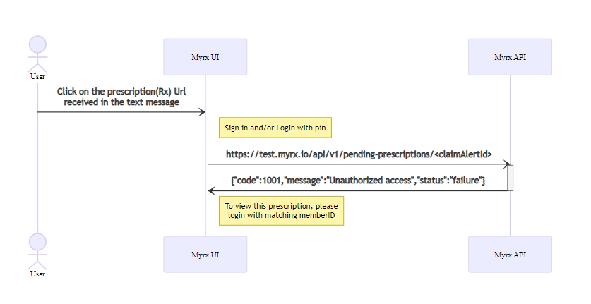

## What is Claim Alert?

When a new prescription is available for a PBM user, pharmacy/ prescriber sends
a claim to Prescryptive. Upon receiving the claim, Prescryptive processes the
claim via claim alert service to see if there is an alternative (generic or
other brand alternatives) to the original prescription which would lower the
cost. If an alternative is found, a “claim alert” message is sent to the user.

## How does Claim Alert flow work?

When Prescryptive receives a claim, “Claim Alert Service” ingests the
prescription and processes the claim to send a notification (text message) to
the user.

## How to generate claim Alert message

This document has detailed steps to generate claim alert text.

https://prescryptivehealth.sharepoint.com/sites/Engineering/Shared%20Documents/Forms/AllItems.aspx?RootFolder=%2Fsites%2FEngineering%2FShared%20Documents%2FProduct%20%2D%20MyRx%2Fmyrx%2Dux&FolderCTID=0x012000D6E8AA1D215D3E4F89BD91B985FB8C22

### Services involved

1. Claim Alert service
1. Twilio

## Syntax:

User receives a text message with a claim alert URL that looks like,
https://test.myrx.io/62156d11d4780b3dfd623892

## Functional flow

When user clicks on the claim alert link, they fall into one of the following
workflow,

#### 1. Brand new user flow

#### 2. Existing/ returning user flow

##### 2.a.With device token

##### 2.b.Without device token (new device/ private mode etc)

- Existing user accessing in a new device or incognito mode:
  

#### 3. Unauthorized user

## Code files

#### UI

packages\common\src\experiences\guest-experience\claim-alert-screen\claim-alert-screen.tsx

#### API

packages\guest-member-api\src\controllers\pending-prescriptions\controller-pending-prescriptions.ts
packages\guest-member-api\src\controllers\pending-prescriptions\handlers\get-pending-prescriptons.handler.ts

#### Database

1. PendingPrescriptionsLists -> for rogue(or mock) urls (ie., myrx.io/rogue-0)
1. MessageEnvelope -> for real users
