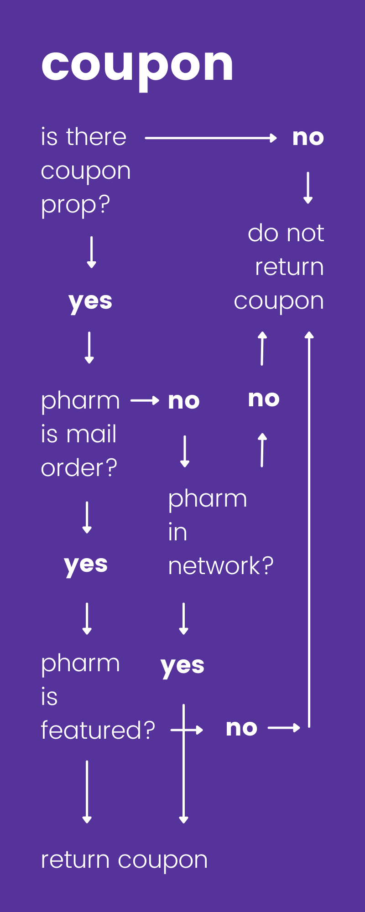
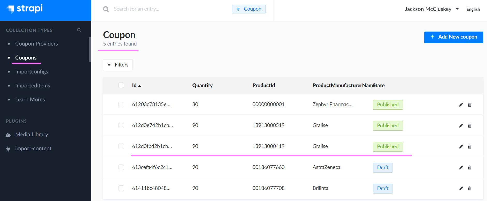
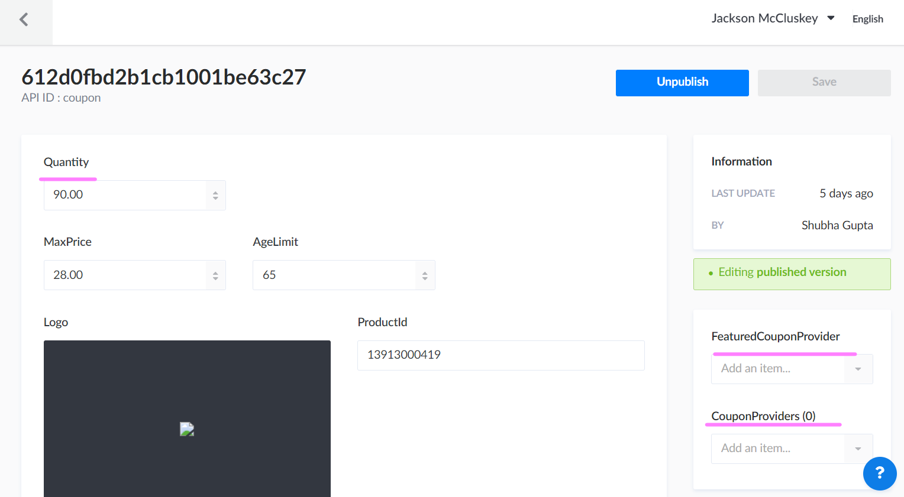

# Coupon

*Pharmacy and Price Search for Prescription* <br />

**Endpoint:** searchPharmacyHandler (search-pharmacy.handler.ts)<br />

**On Success:** returns searchPharmaciesAndPrices(...)<br />

**On Success:** returns getPharmaciesAndPricesForNdc(...)<br />
--<br />

*Pharmacy and Price Search for a Drug* <br />

**Endpoint:** searchPharmacyDrugPriceHandler (search-pharmacy-drug-price.handler.ts)<br />

**On Success:** returns getPharmaciesAndPricesForNdc(...groupPlanCode, ndc, quantity...)<br />

**getPharmaciesAndPricesForNdc:**<br />
- calls `getCouponByNdcAndQuantity(ndc, quantity...);` to get **coupon** as ICouponResponse
- returns SuccessResponse with `buildPharmacyResponse(...coupon);` if user is CASH

# buildPharmacyResponse

<br />

Props:<br />
- pharmacies: IPrescriptionPharmacy[],
- sortBy: string,
- limit: number,
- pharmacyPrices: IDrugPriceNcpdp[],
- **coupon?: ICoupon**

<br />

ICoupon:<br />
```
{
  ProductId: string;
  Quantity: number;
  ProductManufacturerName: string;
  FeaturedCouponProvider?: ICouponProvider;
  CouponProviders: ICouponProvider[];
  MaxPrice: number;
  AgeLimit: number;
  IntroductionDialog: string;
  EligibilityURL: string;
  CopayText: string;
  CopayAmount: number;
  GroupNumber: string;
  PCN: string;
  MemberId: string;
  BIN: string;
  Logo?: ICouponLogo;
}
```

<br />

Providers:<br />

**FeaturedCouponProvider** (Single {...}):<br />
- if empty {} in response then no featured
- if pharmacy, from `pharmacies`, ncpdp matches this ncpdp, then considered 'Featured'
- if isMailOrderOnly and this is true, disregard network of CouponProviders

<br />

FeaturedCouponProvider & CouponProviders are not related in CouponAPI logic, each is **independent**<br />
Coupon is returned if `( is mail AND featured ) OR ( not mail AND in network )`

<br />

**CouponProviders** (Many [{...}, {...}, ...]):<br />
- if empty [] in response then considered 'Open Network'
- if has values [{...}, {...}, ...] then considered 'Network'
- if pharmacy, from `pharmacies`, ncpdp matches any ncpdp in this, then considered 'In Network'
- if pharmacy, from `pharmacies`, ncpdp does not match any ncpdp in this, then considered 'Not In Network'

<br />



<br />

**buildPharmacyResponse Coupon Layman Logic:**

<br />

1. Is buildPharmacyResponse being called with a coupon prop? (i.e. is coupon not undefined)<br />

- YES > CONTINUE TO 2.
- NO > STOP. *No coupon will exist in response.*

<br />

2. Loop through each pharmacy within pharmacies.

<br />

3. Is the current pharmacy we are checking a mail order pharmacy? (i.e. does the npi match declared mail order npi values in is-mail-order-only.ts)<br />

- YES > CONTINUE TO 4.
- NO > CONTINUE TO 5.

<br />

4. Is the current pharmacy featured? (i.e. does the featured coupon provider ncpdp match the current pharmacy ncpdp)<br />

- YES > CONTINUE TO 6.
- NO > STOP. *No coupon will exist in response.*

<br />

5. Is the current pharmacy in network? (i.e. are there no given coupon providers for this coupon or does the current pharmacy ncpdp match any of the given coupon provider ncpdp(s))<br />

- YES > CONTINUE TO 6.
- NO > STOP. *No coupon will exist in response.*

<br />

6. Return `coupon` as ICouponDetails<br />

**ICouponDetails:**<br />
```
{
  productManufacturerName: string;
  price: number;
  ageLimit: number;
  introductionDialog: string;
  eligibilityURL: string;
  copayText: string;
  copayAmount: number;
  groupNumber: string;
  pcn: string;
  memberId: string;
  bin: string;
  featuredPharmacy: string;
  logo: ICouponLogo | {};
}
```

<br />

# buildPharmacyResponse (Extended)

<br />
<br />

**hasCoupon:**<br />
- equivalent to `!!coupon`, where coupon is an optional prop
- if true, coupon details extracted from coupon prop into `couponInfo` as ICouponDetails
- if false, pharmacy response does not include a coupon property

<br />

**couponInfo:**<br />
- contains equivalent values in `coupon` but as ICouponDetails
- only initialized if `hasCoupon`

<br />

**isOpenNetwork:**<br />
- equivalent to the emptiness of the coupon providers array in coupon `coupon?.CouponProviders`
- if `coupon` is undefined, this value is true
- if `coupon` is defined and there are no coupon providers in coupon, 
  - `coupon?.CouponProviders?.length === 0`, this value is true
- if `coupon` is defined and there are coupon providers, 
  - `coupon?.CouponProviders?.length !== 0`, this value is false

<br />

**pharmacyIsMailOrderOnly:**<br />
- equivalent to if the pharmacy npi matches one of the npis declared in *is-mail-order-only.ts*
- this value is used as the `isMailOrderOnly` value in the pharmacy property in response
- example, 'Premier Pharmacy' npi is '1053486795', if pharmacy npi is equivalent, then this value is true
- if true, then `pharmacyIsFeatured` determines if coupon property will exist in response
- if false, then `pharmacyIsInNetwork` determines if coupon property will exist in response

<br />

**pharmacyIsFeatured:**<br />
- equivalent to if the pharmacy ncpdp matches `coupon?.FeaturedCouponProvider?.NCPDP` 
- if true, then this will add the current `pharmacyDrugPrice` to the response
- if `pharmacyIsMailOrderOnly` is true, then this determines if coupon property will exist in response

<br />

**pharmacyIsInNetwork:**<br />
- equivalent to `isOpenNetwork` or if the current pharm ncpdp matches a `coupon?.CouponProviders?.NCPDP`
- if true, coupon will be added to the current `pharmacyDrugPrice`

<br />

# Strapi (Coupons)

`Strapi` > `Coupons` contains all existing coupons and value inputs. Click [here](https://content.test.prescryptive.io/admin/plugins/content-manager/collectionType/application::coupon.coupon)

<br />



<br />

Alpha-numeric values can be input (see left)<br />
A featured pharmacy and coupon providers can be set (see right)<br />




