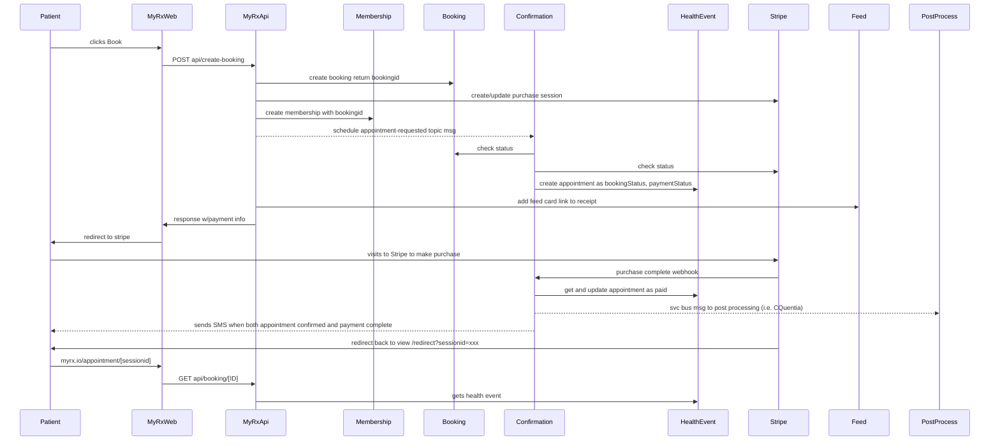

# Payment integration

## Table of Contents:

- [Payment integration](#payment-integration)
  - [Table of Contents:](#table-of-contents)
  - [Background](#background)
  - [Configuration](#configuration)
    - [Deeplink URLS](#deeplink-urls)
    - [Web/API Settings](#webapi-settings)
    - [Product Identifiers](#product-identifiers)
  - [Payment Flow](#payment-flow)

---

## Background

- Stripe is our payment processor

- If you need access to Stripe's developer tools, ask for a developer invite

- Each member will have a "cash" membership record - that is used for things
  they buy with cash (as opposed to a membership provided by an employer or
  another 3rd party)

  > `NOTE` "membership" records are misnamed in the MyRx (RxAssistant) mongo db.
  > They are currently named "person"

---

## Configuration

### Deeplink URLS

- Payment Checkout Session URLS will be:
  - success_url:
    `${baseUrl}/checkout/result?id={CHECKOUT_SESSION_ID}&s=success&r={urlescape(document.location.query)}`,
  - cancel_url:
    `${baseUrl}/checkout/result?id={CHECKOUT_SESSION_ID}&s=cancel&r={urlescape(document.location.query)}`,

### Web/API Settings

- paymentsKeyPublic

  - this is the public key provided by Stripe
  - this key must be sent to the client side
    - we will either
      - return it in the call that provides the current price config (see
        getProductPrice in payments/checkout-session.ts)
      - or provide it via a config setting in the UX
  - in QA, this should be the Test public key

- paymentsKeyPrivate

  - this is the private key provided

### Product Identifiers

- Product.Price
  - each Product configured in Stripe can have more than one published price
  - each Product.Price has an ID that needs to be used when creating the
    checkout session
  - we will correlate each Pharmacy Provider-Location PCR Test "Service" with a
    specific Product.Price ID

## Payment Flow

// see recommended extensions to preview mermaid

