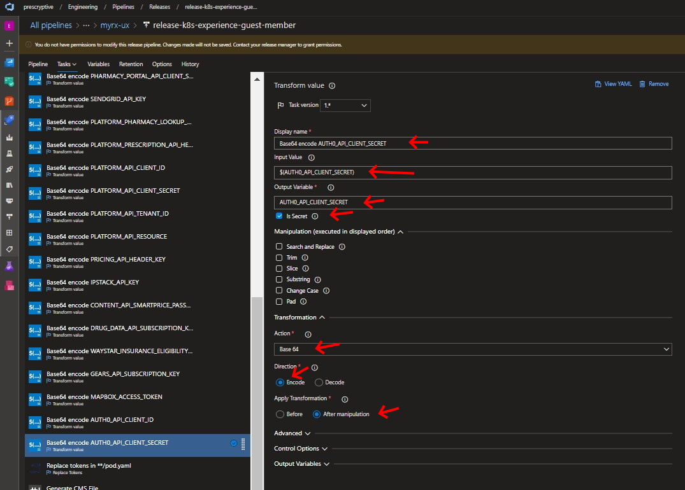

# Adding and using API environment variables

This document outlines the steps required to add and use API environment
variables, including the important steps of how to update the application
_release_ pipeline to set those enviroment variables during deployment.

## Table of Contents

- [Adding environment variables](#adding-environment-variables)
  - [Update environment file](#update-environment-file)
  - [Load variables into configuration](#load-variables-into-configuration)
- [Using environment variables](#using-environment-variables)
- [Publish updated environment file](#publish-updated-environment-file)
- [Update release pipeline](#update-release-pipeline)
  - [Update pod.yaml](#update-podyaml)
  - [Update key vault](#update-key-vault)
  - [Update variable group](#update-variable-group)
  - [Update pipeline variables](#update-pipeline-variables)
  - [Base-64 encode secret variables](#base-64-encode-secret-variables)

---

## Adding environment variables

### Update environment file

> **Important!** Make sure you have the latest version of the environment file
> before adding your variables.
>
> From the **myrx-ux/env-test** folder of the "Files" tab in the **Product -
> MyRx** Teams channel:
>
> 1. Download **env.guest-member-api.test.md**
> 1. Copy the file to **packages/guest-member-api** (_don't_ rename the file to
>    **.env**)

Add your environment variables. For example:

```
## AUTH0

AUTH0_API_CLIENT_ID="blah"

AUTH0_API_CLIENT_SECRET="blah blah"
```

### Load variables into configuration

Update **configuration.ts**:

1. Update `IConfiguration` for your new variables. If you have several, related
   variables, it might make sense to add a configuration sub-group. For example:

```
export interface IAuth0Config {
  clientId: string;
  clientSecret: string;
}

export interface IConfiguration {
  ...
  auth0: IAuth0Config;
  ...
}

```

2. Load and validate variables. For example:

```
  ...
  const auth0ApiClientId = process.env.AUTH0_API_CLIENT_ID;
  if (!auth0ApiClientId) {
    throw new Error('AUTH0_API_CLIENT_ID missing');
  }

  const auth0ApiClientSecret = process.env.AUTH0_API_CLIENT_SECRET;
  if (!auth0ApiClientSecret) {
    throw new Error('AUTH0_API_CLIENT_SECRET missing');
  }
  ...
  return {
    ...
    auth0: {
      clientId: auth0ApiClientId,
      clientSecret: auth0ApiClientSecret,
    },
    ...
  };

```

---

## Using environment variables

Once loaded, using environment variables is as simple as accessing the
configurtion object. For example:

```
  const { clientId, clientSecret } = config.auth0;

```

---

## Publish updated environment file

Once, you've verified your code changes and environment file updates, publish
the updated file to Teams.

> **Important!** Make sure you have any updates to the environment file that
> have occurred since you last downloaded the file.

1. Upload the updated environment file to the **myrx-ux/env-test** folder of the
   "Files" tab in the **Product - MyRx** Teams channel
2. Notify team members of the update by posting a message to the
   **SuperPod-Consumer(myRx)** channel in Teams. It's helpful to give a brief
   summary of the changes.

---

## Update release pipeline

> **Note**: The steps are different for unprotected and protected (secret)
> environment variables. Secret environment variables are those that contain
> confidential information like passwords, client ids, and client secrets.

### Update pod.yaml

#### `Unprotected environment variables`

For unprotected environment variables, simply add a name/value pair to the `env`
section of **/pipelines/pod.yaml**. For example:

```
- name: AUTH0_TOKEN_API
  value: '${AUTH0_TOKEN_API}'
```

The `value` will be the name of the environment variable as defined in the
release pipeline variables. Just match the name and value (as in the example),
to keep things simple.

#### `Protected (secret) environment variables`

First, add the environment variable name to the `data` section of
**/pipelines/pod.yaml**. For example:

```
  AUTH0_API_CLIENT_SECRET: ${AUTH0_API_CLIENT_SECRET}
```

Next, add a secret key reference to the `env` section of **pod.yaml**. For
example,

```
- name: AUTH0_API_CLIENT_SECRET
  valueFrom:
    secretKeyRef:
      name: ux-experience-guest-member
      key: AUTH0_API_CLIENT_SECRET
```

The `key` here, corresponds to the name used in the `data` section in the
previous step.

### Update key vault

Follow these steps for any secret environment variable values to be added.

1. Log into the [Azure Portal](https://portal.azure.com) with your
   **prescryptive.io** credentials (not your **prescryptive.com** credentials).
1. Open the **keyvault-west-test** key vault.
1. Click on "Secrets"
1. Click "Generate/Import"
1. Specify a key name and the secret value.
   > **Note**: Prefix the key name with **myrx-api-** to keep the keys separate
   > from those for other applications.
1. Press "Create"


### Update variable group

1. After secret has been created in the key vault, navigate to the
   [library in ADO](https://dev.azure.com/prescryptive/Engineering/_library?itemType=VariableGroups).
1. Select **variablegroup-keyvault-west-test** variable group.
   
1. Scroll all the way down and click on "Add"
   
1. Select the secret you want to add and click "Ok"
   
1. Click "Save" on the variable group library

### Update pipeline variables

1. In ADO, go to Engineering > Pipelines > Releases
1. Click on **release-k8s-experience-guest-member**
1. Click "View" button in upper right.
   
1. If you have sufficient permissions, there should be a button to edit the
   release.
1. Open the "Variables" tab.

#### `Unprotected variables`

1. Add the variable name and value with scope **Release** to the "Pipeline
   variables" list.
   

#### `Secret variables`

1. Add the variable name and _key vault key name_ with scope **Release** to the
   "Pipeline variables" list. Enclose the key name in `$()`
   > **Important!** Note that this is `$()` and not `${}`


### Base-64 encode secret variables

Secret variables in the pipeline need to be base-64-encoded.

In ADO, go to Engineering > Pipelines > Releases

1. Click on **release-k8s-experience-guest-member**
1. Click "View" button in upper right.
   
1. If you have sufficient permissions, there should be a button to edit the
   release.
1. Open the "Tasks" tab.
1. If you have sufficient permissions, you should be able to add a task. Add a
   base-64 encode task for the secret variable
1. Specify the following:

- input name: name of variable in `$()`
- output name: name of variable
- is secret: checked
- action: "Base 64"
- direction: "encode"
- apply transformation: "after manipulation"
  
